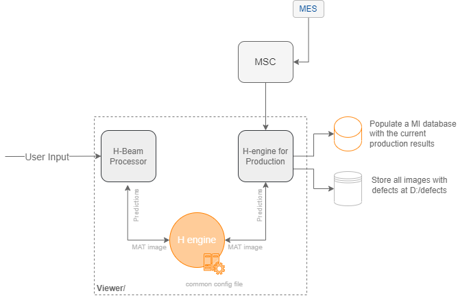
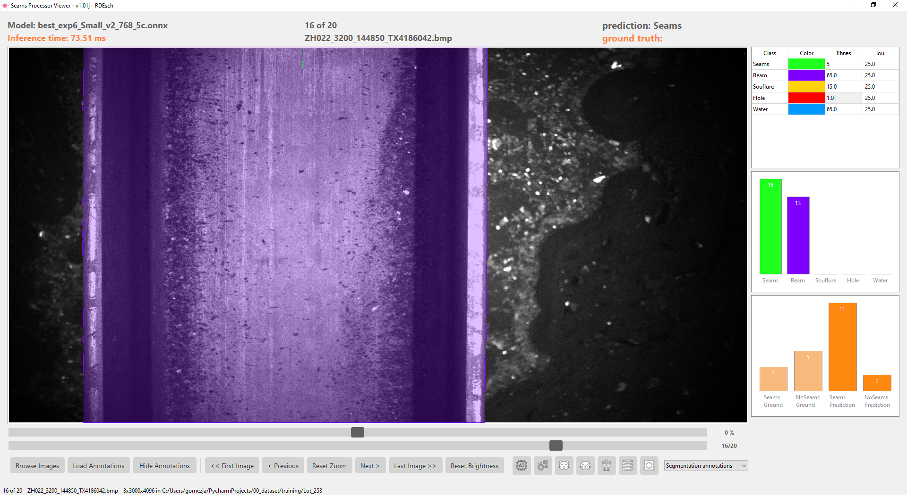

# Seams detection TMB

## Introduction

This repository provides a solution for detecting seams in H-beams during operations at TMB. 
The solution is built upon convolutional neural networks, with a specific emphasis on utilizing 
YOLOv5 as the backbone network responsible for extracting high-level features from the input image.


## Repository Structure

The repository is organized as follows:

- `_dev_features/`: in development features
- - `cvat_Yolo/cvat_LotCreation.py`: generate Lots of images from the dataset to mimic the same structure as *Infoscribe*. it places inside every Lot approximately 20 images and the file *annotations.xml*, which is the CVAT format for polygon annotations.
- - `cvat_Yolo/cvat_pacifier.py`: checks that there are no images/annotations lost.
- - `cvat_Yolo/cvat_converter`: converts from CVAT annotations in polygons format to Yolo format.
- `ShadowStarter/`: C# application to keep alive MSC and H-engine running in production.
- `Training/`: all the python scripts for training, this is a clone from the original Yolov5 from ultralytics.
- - `ManifestGenerator.py`: in-house addition to Yolov5 in order to generate the yaml file needed by Yolo describing the dataset and classes.
- `Viewer/`: all the python code to run *H-Beam Processor* and *H-engine* in production.
- - `main.py`: entry point to H-Beam Processor.
- - `production.py`: made to be run in production, with functionalities to populate databases and record image with defects but there is no interface, it is a console application.

### Flowchart

The following diagram shows the interaction between *H-Beam Processor* and *H-engine in Production*:



### H-Beam Processor

This application is designed for testing the models after training. It also supports the display of CVAT 1.0 and Yolo 1.1 annotations.



### H-engine for production

Console application using the same engine for inference as H-Beam Processor but made for production. It interacts with MSC via socket communication. It receives images capture by MSC and process them with the engine and later one classify the image according its predictions.


## Getting Started

To begin using the tools provided in this repository, follow these steps:

1. Clone the repository to your local machine.

2. Execute Viewer/main.py to start H-Beam processor. Alternative you could start the application by executing Viewer/HBeamProcessor.bat but you might need to configure the location of your python environment.

3. Execute Viewer/production.py. Alternative you could start the application by executing Viewer/HBeamProcessor.bat but you might need to configure the location of your python environment.

Example of `production.bat` to start up the H-engine in production mode:

```bash
@echo OFF

SETLOCAL EnableDelayedExpansion

SET CONDA=D:\__TMB_SeamsReleases\env\seams
SET LOCATION=D:\__TMB_SeamsReleases\H_Processor
SET PATH=%CONDA%\Scripts;%CONDA%;%PATH%

CALL activate base
START python production.py

@echo ON
```

## Database Credential

Databases:

H-engine is population a MI database with the following credentials:

```python
db = SEAMS_INFO(
    source='AZR-SQL-MIAUT',
    user='SEAMS-DETECT_Publisher',
    pwd='AMseams2023Q3',  # attention!, it expires every 3 month
    catalog='SEAMS_DETECTIONS'
)
```

The database is a SQL SERVER, the recommended library is MSOLEDBSQL.

## Computers Credentials

### New and currently working computers:

| PC type              | PC Name       | IP Address    | User             | Password    |
|----------------------|---------------|---------------|------------------|-------------|
| Seams production PC  | DESKTOP-seams | 10.28.100.15  | .\arcelormittal  | Arcelor**   |
| Seams Station at AOB | CZC8317B48    | 10.26.100.218 | EUROPE\GRACRAOB  | AM@grd2018* |

### CVAT

The application used by Infoscribe for making annotations is installed on the Seams Station:

```python
host='http://czc8317b48:8080/'
user='aob'
pw='aob2023'
```

## Feedback and Support

If you have any questions, suggestions, or issues related to the SDM Data Extraction, [open an issue](https://github.com/your-username/sdm-data-extraction/issues) in this repository.